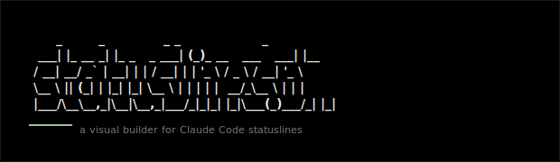

<div align="center">



**A visual builder for [Claude Code](https://docs.claude.com/en/docs/claude-code) statuslines.**
Design the bar at the bottom of your terminal in the browser, then paste one command to install it.

[Quickstart](#quickstart) · [Features](#features) · [Architecture](#architecture) · [API](#api) · [Contributing](#contributing)


</div>

---

## Why

Claude Code lets you customise the status line at the bottom of the CLI by pointing it at any executable that reads a JSON payload on stdin and emits styled text to stdout. Writing that script by hand means hand-rolling ANSI escape codes and JSON parsing in `bash` or `PowerShell`, then editing `~/.claude/settings.json` without clobbering everything else in it.

`statusline.sh` removes that friction end-to-end:

1. **Design** visually — drag elements onto a canvas, style them, see a live preview.
2. **Save & share** — get a one-liner install command (or export the design as JSON).
3. **Install** — paste the command. Your existing `settings.json` is preserved and backed up.
4. **Browse** — publish to the community gallery, fork what others built.

---

## Features

| | |
|---|---|
| **Visual design** | Drag-and-drop canvas. 19 element types: model name, working directory (basename / full / tilde), git branch & status, lines added/removed, context %, 5h and 7d rate-limit % and bars, cost, session duration, progress bars, segment-split paths, glyphs, rotators, separators, conditional visibility, static text. |
| **Full styling** | 16 / 256 / RGB foreground & background colours. Bold, italic, dim, underline. Per-element prefix, suffix, max length, and `showWhen` predicates (`exists`, `gt`, `lt`, `eq`). |
| **Live preview** | Pure-JS ANSI interpreter renders the statusline in a faux-terminal chrome as you edit. Hot-swappable mock stdin payloads. |
| **Cross-platform install** | One IR compiles to `bash` (macOS / Linux) and `PowerShell` (Windows). Both backends produce byte-identical output (after stripping ANSI). |
| **Safe installer** | Structured JSON merge into `~/.claude/settings.json` — never string replacement. Timestamped `.bak.<unix-ms>` backups. Opt-in self-heal via `claude -p` if every parser (`jq` → `python3` → `python`) fails. |
| **Community gallery** | Publish a design with name, author, description. Browse Recent / Popular with cursor pagination. Fork to your own builder in one click. Profanity & slur filter, Turnstile-protected. |
| **Crawlable** | Worker serves `robots.txt`, `sitemap.xml` covering every community design, and deterministic OG share SVGs at `/og/community/:slug.svg`. |
| **Offline-friendly** | Export and import designs as JSON. Drafts live in `localStorage` (Zustand) until you explicitly publish. |

---

## Quickstart

The app is split across two deploy targets: a static React SPA (hosted on Vercel) and a Cloudflare Worker backed by D1 (handles community, install, and crawl routes). For local development both processes run side-by-side.

```bash
bun install

# Terminal 1 — Worker + D1 (miniflare) on http://localhost:8787
bun --cwd worker dev

# Terminal 2 — SPA with HMR on http://localhost:3001
bun dev
```

The SPA reads `NEXT_PUBLIC_WORKER_URL` (build-time constant inlined into the bundle) to know where to send Worker calls and `NEXT_PUBLIC_TURNSTILE_SITE_KEY` for the publish flow. When neither is set, `config.ts` falls back to `http://localhost:8787` on localhost and Cloudflare's "always-passes" Turnstile dev key — so a fresh clone Just Works.

For a one-shot production-style build (writes `./dist`, serve with any static file host):

```bash
bun run build
bunx serve ./dist
```

> **Requirements:** [Bun](https://bun.sh) >= 1.1 (frontend bundler, dev server, test runner) and [Wrangler](https://developers.cloudflare.com/workers/wrangler/) (Worker dev + deploy). No Node, npm, or Vite.

### Environment variables

| Variable | Where | Purpose |
|---|---|---|
| `NEXT_PUBLIC_WORKER_URL` | SPA build env | Origin of the deployed Worker, e.g. `https://api.statusline.sh` |
| `NEXT_PUBLIC_TURNSTILE_SITE_KEY` | SPA build env | Public Turnstile site key used by the publish + fork + anonymous-install flows |
| `TURNSTILE_SITE_KEY` | `wrangler.toml` `[vars]` | Public Turnstile site key (informational) |
| `TURNSTILE_SECRET_KEY` | Worker secret | Server-side Turnstile verification — set via `wrangler secret put` |
| `ALLOWED_ORIGINS` | `wrangler.toml` `[vars]` | Comma-separated origin allowlist on top of the built-in production patterns |

### Deploying the Worker

One-time setup:

```bash
cd worker
wrangler login
wrangler d1 create statusline-community           # copy database_id into wrangler.toml
wrangler secret put TURNSTILE_SECRET_KEY          # publish + fork + install protection
```

Each deploy:

```bash
cd worker
wrangler d1 migrations apply statusline-community --remote
bun run seed > /tmp/seed.sql                      # generates INSERT SQL for starter designs
wrangler d1 execute statusline-community --remote --file=/tmp/seed.sql
wrangler deploy
```

The Worker also schedules a daily cron (`0 4 * * *`) that reaps `install_records` older than 7 days — anonymous installs are intentionally ephemeral.

### Deploying the SPA (Vercel)

Set `NEXT_PUBLIC_WORKER_URL` and `NEXT_PUBLIC_TURNSTILE_SITE_KEY` in the Vercel project, then `bun run build` produces `./dist`. Vercel serves it as a static bundle.

The build also writes `robots.txt`, `sitemap.xml`, `site.webmanifest`, `og-default.svg`, and pre-rendered HTML shells for `/builder`, `/community`, `/privacy`, and `/terms` (each with route-specific `<title>`, OG metadata, and JSON-LD). Keep Vercel's `cleanUrls` enabled so those shells serve before the SPA fallback rewrite in `vercel.json`.

---

## Architecture

### Routes

Frontend (`src/App.tsx` + `src/frontend/router.tsx`, hand-rolled, no react-router):

| Route | Purpose |
|---|---|
| `/` | Landing page with a live-animating hero statusline and curated template gallery |
| `/builder` | Drag-and-drop editor: palette · canvas · live preview · collapsible inspector · install drawer · publish dialog |
| `/builder?template=:id` · `?fork=:id` | Builder pre-loaded from a template or community design |
| `/community` | Bento-grid gallery sorted by Recent or Popular (infinite scroll, cursor-paginated) |
| `/community/:slug` | Single-design view with install command and Fork CTA |
| `/privacy` · `/terms` | Static legal pages |

### One IR, three backends

The compiler is the spine of the project. `packages/shared/src/compiler/ir.ts` lowers a `Design` to a `RenderOp[]`. Three consumers then produce **byte-equivalent output** (after stripping ANSI) for the same input:

```
              +--> compiler/bash.ts         -> bash script   (jq -> python3 -> python fallback)
Design --> IR +--> compiler/powershell.ts   -> PowerShell    (ConvertFrom-Json -Depth 50, Console.Out.Write)
              +--> compiler/interpret.ts    -> ANSI string   (browser preview / hero / community cards)
```

Parity is enforced in `test/compiler.test.ts`, which spawns the compiled bash with mock JSON on stdin and diffs against the JS interpreter, then does the same for PowerShell where available.

### Installer flow

`GET /i/:id.sh` and `GET /i/:id.ps1` return self-contained installer scripts that:

1. Embed the compiled statusline via a **quoted heredoc** (bash `<<'STATUSLINE_EOF'`) or **single-quoted here-string** (PowerShell `@' ... '@`) — no shell expansion, so paths and special characters round-trip byte-for-byte.
2. Write to `${CLAUDE_CONFIG_DIR:-$HOME/.claude}/statusline.sh` (or `.ps1`) with the executable bit set.
3. Back up the existing `settings.json` to `settings.json.bak.<unix-ms>`.
4. Perform a **structured JSON merge** that preserves every other top-level key (`model`, `permissions`, `mcpServers`, ...). Bash uses `jq` then `python3` then `python`. PowerShell uses `ConvertFrom-Json -Depth 50` / `ConvertTo-Json -Depth 50`, written UTF-8 no BOM via `[Console]::Out.Write`.
5. If — and only if — every merge backend fails **and** `STATUSLINE_SELFHEAL=1` is set **and** `claude` is on `PATH`, the installer offers to shell out to `claude -p` with a truncated snippet for repair. Self-heal stays opt-in.

End-to-end coverage lives in `test/e2e.test.ts` and `worker/test/installer.test.ts`: they run the real installer against a temp directory with a pre-populated `settings.json` and assert that other keys survive, the `.bak` is created, and the installed script produces the expected styled output.

### State

- **`designStore`** (Zustand + persist, key `statusline-design-v1`) — `design`, `selectedId`, plus capped 50-deep `past` / `future` history stacks. All mutations route through a `withHistory` helper that `structuredClone`s the prior state.
- **`uiStore`** — panel collapse, OS override, mock preset, self-heal toggle. Local only, never synced server-side.
- **`useShareState`** (sessionStorage) — `{designId, slug}` so refreshes don't lose the "Saved as &lt;id&gt;" indicator.

### Database

Community designs live in **Cloudflare D1** (SQLite-compatible serverless DB), accessed exclusively from the Worker via `worker/src/designs.ts`. Schema (from `worker/migrations/0001_init.sql`):

```sql
CREATE TABLE designs (
  id            TEXT    PRIMARY KEY,
  json          TEXT    NOT NULL CHECK (length(json) BETWEEN 2 AND 32768),
  slug          TEXT    NOT NULL UNIQUE,
  name          TEXT    NOT NULL CHECK (length(name) BETWEEN 1 AND 60),
  author_name   TEXT    NOT NULL CHECK (length(author_name) BETWEEN 1 AND 40),
  description   TEXT    NOT NULL DEFAULT '' CHECK (length(description) <= 200),
  forked_from   TEXT    REFERENCES designs(id),
  published_at  INTEGER NOT NULL,
  views         INTEGER NOT NULL DEFAULT 0 CHECK (views >= 0),
  forks         INTEGER NOT NULL DEFAULT 0 CHECK (forks >= 0)
);
CREATE INDEX idx_designs_recent  ON designs(published_at DESC, id ASC);
CREATE INDEX idx_designs_popular ON designs(forks DESC, views DESC, id ASC);

CREATE TABLE install_records (
  id          TEXT    PRIMARY KEY,
  json        TEXT    NOT NULL CHECK (length(json) BETWEEN 2 AND 32768),
  created_at  INTEGER NOT NULL
);
CREATE INDEX idx_install_records_created_at ON install_records(created_at);
```

`install_records` backs anonymous one-shot installs (Build -> Install without publishing). The daily cron reaps rows older than 7 days. The two compound indices back the cursor-paginated community listing: `(published_at DESC, id ASC)` for Recent · `(forks DESC, views DESC, id ASC)` for Popular. Cursors are opaque base64url JSON. Page responses are edge-cached for 60s.

### Project layout

```
packages/shared/src/        Types, schema, ANSI helpers, templates, mock stdin
                            + compiler/{ir,bash,powershell,interpret,progressBar}.ts
                            (consumed by both SPA and Worker)

src/                        Frontend SPA (deployed to Vercel)
  index.html, frontend.tsx, App.tsx, index.css, dev.ts
  shared/animatedMocks.ts   Browser-only animation helpers
  frontend/
    router.tsx              Hand-rolled router (no react-router)
    seo.ts                  Route metadata + JSON-LD
    lib/                    api client, config, navigate, turnstile widget
    store/                  designStore (Zustand) + uiStore
    hooks/                  useDnd, useUndoRedo, useOsDetect, useAnimatedMock, useShareState
    components/
      Landing/   Builder/   Palette/   Canvas/   Inspector/   Preview/
      Install/   Community/ Layout/    Modal/    ContextMenu/ Brand/   Legal/  Seo/

worker/                     Cloudflare Worker (deployed via Wrangler)
  src/
    index.ts                Worker entrypoint (routes + handlers)
    router.ts               Hand-rolled URL matcher
    designs.ts              D1 data layer: publish, list, fork, install records
    cors.ts                 Origin allowlist (env + built-in patterns)
    ratelimit.ts            Per-endpoint Cloudflare Rate Limiting bindings
    turnstile.ts            siteverify wrapper + client-IP extraction
    sanitize.ts             NFKC + zero-width strip + slur/profanity denylist
    seo.ts, og.ts           robots.txt, sitemap.xml, /og/community/:slug.svg
    handlers/installer.ts   /i/:id.{sh,ps1} render
    install/{bashTemplate,psTemplate}.ts
  migrations/0001_init.sql  D1 schema
  scripts/seed.ts           Emits INSERT SQL for starter community designs
  test/                     7 suites (handlers, designs, installer, cors, turnstile, router, seo)

test/                       Root suite — shared, compiler, store, templates, builder-seed, e2e, seo
```

---

## API

All Worker routes are mounted at the Worker root (no `/api` prefix). The SPA targets `${NEXT_PUBLIC_WORKER_URL}/<path>` cross-origin via CORS.

```
GET    /community?sort=recent|popular&limit=24&cursor=...    -> { items, nextCursor }
GET    /community/:slug                                       -> full design + metadata (view tracked)
POST   /community/:slug/fork    body: { turnstile_token }     -> { ok: true }   (increments forks)

POST   /designs                 body: { design, name, author_name, description, turnstile_token }
                                                              -> { id, slug }   (publishes to gallery)
POST   /install                 body: { design, turnstile_token }
                                                              -> { id }         (anonymous one-shot)

GET    /i/:id.sh                                              -> text/x-shellscript   (bash installer)
GET    /i/:id.ps1                                             -> text/plain           (PowerShell installer)

GET    /robots.txt                                            -> robots policy
GET    /sitemap.xml                                           -> XML sitemap of every published design
GET    /og/community/:slug.svg                                -> deterministic OG share image
```

Rate limits (per client IP, 60s window): publish 5, fork 20, install 30, list 120, detail 240, installer 60. CORS is enforced via an env-driven allowlist plus a built-in regex pattern for the production aliases. All POST endpoints require a valid Cloudflare Turnstile token.

---

## Testing

```bash
bun test                              # root suite (frontend + shared + e2e)
bun --cwd worker test                 # Worker suite (D1 + API + installer)
bun test test/compiler.test.ts        # IR + 3 backends, including live bash exec
bun test -t "preserves settings.json" # single test by name pattern
```

| Suite | What it covers |
|---|---|
| `test/shared.test.ts` | Types, schema validator, ANSI parser |
| `test/compiler.test.ts` | IR lowering, three-backend parity, live bash + PowerShell execution |
| `test/store.test.ts` | Zustand store, history (undo/redo), uiStore |
| `test/templates.test.ts` | All curated templates compile + tween helpers for the hero animation |
| `test/builder-seed.test.ts` | `?template=` / `?fork=` URL parsing |
| `test/seo.test.ts` | robots.txt, sitemap, route metadata, JSON-LD shape |
| `test/e2e.test.ts` | Design -> Worker -> installer -> on-disk `settings.json` verification |
| `worker/test/handlers.test.ts` | Publish / list / detail / fork / install handlers (direct, no `unstable_dev`) |
| `worker/test/designs.test.ts` | D1 data layer, cursor encoding, slug collision recovery |
| `worker/test/installer.test.ts` | `/i/:id.{sh,ps1}` end-to-end against miniflare |
| `worker/test/router.test.ts` | Hand-rolled matcher edge cases (param decoding, regex escaping) |
| `worker/test/cors.test.ts` | Allowlist + preflight behaviour |
| `worker/test/turnstile.test.ts` | siteverify mocking + client-IP precedence |
| `worker/test/seo.test.ts` | robots / sitemap / OG SVG rendering |

---

## Tech stack

**SPA:** Bun 1.1+ (bundler, dev server, test runner) · React 19 · Tailwind CSS v4 · Zustand 5 · dnd-kit · Phosphor Icons · nanoid — deployed to Vercel as a static bundle.
**Worker:** Cloudflare Workers · D1 (SQLite) · Turnstile · Cloudflare Rate Limiting · Analytics Engine (optional) · Cron Triggers — deployed via Wrangler 3.
**Shared:** `packages/shared` workspace publishes the design schema, compiler IR + three backends, ANSI helpers, mock stdin, brand art, and template library to both targets.
**No:** Node, npm, Vite, react-router, Hono, itty-router, Express, Zod — by design.

---

## Contributing

PRs welcome. Before opening one, run `bun test && bun --cwd worker test` and make sure both suites are green.

Adding a new element type touches **seven** places. Miss one and the live preview will silently diverge from the installed script:

1. `packages/shared/src/types.ts` — add to the `Element` discriminated union
2. `packages/shared/src/schema.ts` — runtime validation (also append to `ELEMENT_TYPES`)
3. `packages/shared/src/compiler/ir.ts` — `elementToOps` switch case
4. `packages/shared/src/compiler/{bash,powershell,interpret}.ts` — handle any new `RenderOp` kinds
5. `src/frontend/store/designStore.ts` — `addElement` default factory
6. `src/frontend/components/Palette/` + `Inspector/fields/<Type>Fields.tsx` — palette entry and editor
7. `test/compiler.test.ts` — parity coverage in all three backends

See [`CLAUDE.md`](./CLAUDE.md) for the full set of architectural invariants — compiler parity, installer safety rules, state-management contracts, and the D1 access pattern.

---

## License

[MIT](./LICENSE) (c) Tron Schell
